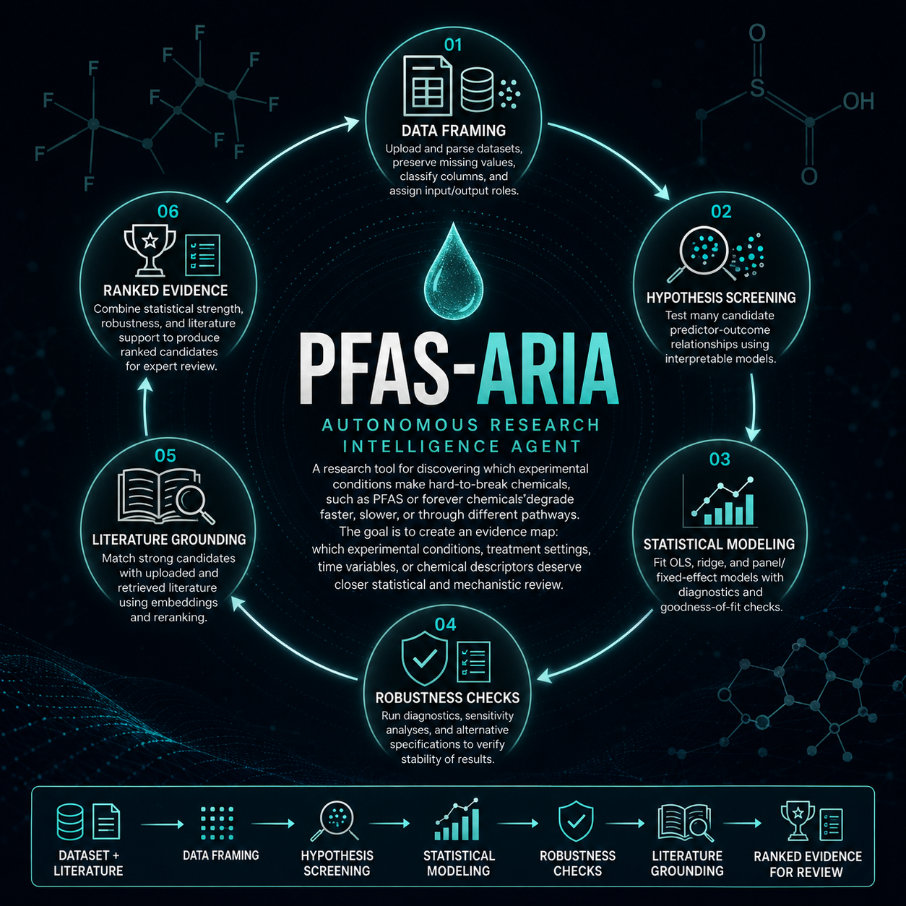

# PFAS-ARIA
### Autonomous Research Intelligence Agent for PFAS Degradation Analysis

[](https://github.com/arpanisi/pfas-aria/actions/workflows/ci.yml)
[](https://codecov.io/gh/arpanisi/pfas-aria)

PFAS-ARIA is an autonomous multi-agent system designed to explore how PFAS (“forever chemicals”) — highly persistent environmental pollutants of global concern linked to serious health risks — may degrade under specific conditions. By combining experimental datasets with scientific literature, the system generates and validates over 100+ hypotheses, tests statistical models, and iteratively refining them against published and preprinted research to identify plausible degradation pathways.



---

## Architecture

```
Data + Papers → Understand → Segment → Hypothesize → Model → Validate → Ground → Report
```

A supervisor agent orchestrates specialist sub-agents in a loop with a configurable convergence condition.

---

## Quick Start

```bash
# 1. Clone
git clone https://github.com/yourusername/pfas-aria.git
cd pfas-aria

# 2. Setup
make setup

# 3. Fill in your environment
cp .env.example .env
# Edit .env with your values

# 4. Add your data and papers
cp your_data.csv data/raw/pfas_data.csv
cp your_papers/*.pdf data/corpus/

# 5. Configure
# Edit configs/data_config.yaml — set outcome_variable at minimum

# 6. Run
make run-pipeline
```

---

## Configuration

All behaviour is controlled through `configs/`. No hardcoded values anywhere.

| File | Controls |
|---|---|
| `data_config.yaml` | Your data file, outcome variable, domain context |
| `agent_config.yaml` | Convergence threshold, max rounds, model families |
| `model_config.yaml` | LLM provider, embedding model |
| `pipeline_config.yaml` | Which phases to run, logging |

---

## Development

```bash
make install-dev    # Install with dev tools + pre-commit hooks
make test           # Run tests
make test-cov       # Tests with coverage
make lint           # Ruff linting
make format         # Auto-format
```

---

## Build Phases

| Phase | Status | Description |
|---|---|---|
| 1 | ✅ | Repo structure, configs, logging, CI/CD |
| 2 | ✅ | Data ingestion, PDF parsing, RAG pipeline |
| 3 | ✅ | Data Intelligence Agent |
| 4 | ✅ | Hypothesis Agent |
| 5 | ✅ | Modeling + Validation Engine |
| 6 | ✅ | Literature Grounding Agent |
| 7 | ✅ | Supervisor Loop (LangGraph) |
| 8 | ✅ | FastAPI Backend |
| 9 | ✅ | React Frontend |
| 10 | ✅ | Report Generator |
| 11 | ⬜ | Deployment and Monitoring |

---

## License

MIT — open source, use freely.
